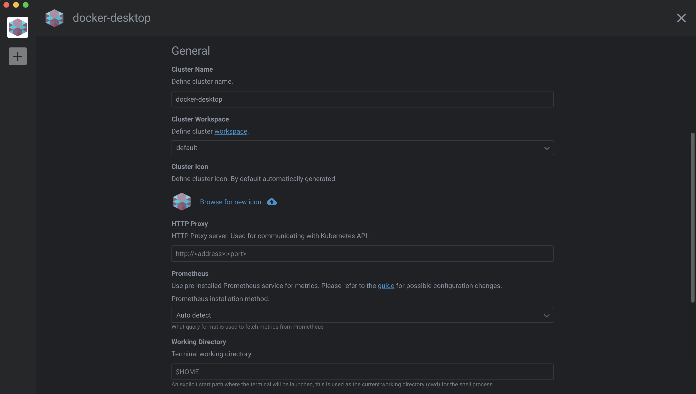
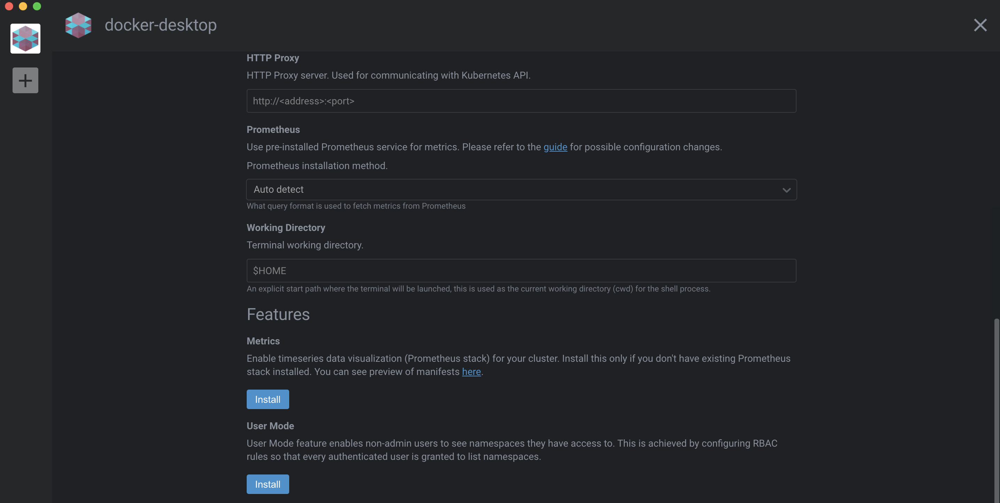
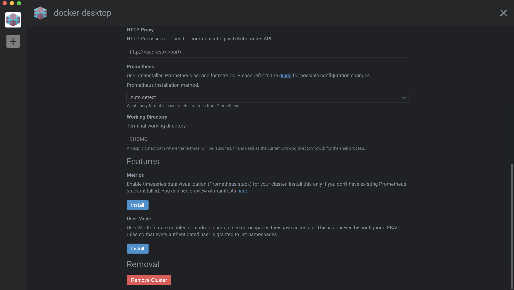

# Settings

It is easy to configure Lens Clusters to your liking through its various settings. 

1. Right-click the name of the cluster in the left-side menu that you want to open the settings for. 
2. Click **Settings**.

## Status

Overview of the cluster status

### Cluster Status

Cluster status information including the detected distribution, kernel version, API endpoint, and online status

## General

General cluster settings

### Cluster Name

The cluster name is inheritated by default from the kubeconfig file. Change the cluster name to another value by updating it here. Note that doing so does not update your kubeconfig file.

### Workspace

This is the Lens workspace that the cluster is associated with. Change workspaces by selecting a different workspace from the dropdown menu. Create a new workspace by clicking **workspace** in "Define cluster workspace" above the dropdown menu. This option will take you the workspaces editor. Create a new workspace and then navigate back to cluster settings.

### Cluster Icon

Lens randomly generates an icon to associate with each newly-created cluster. Use this setting to choose your own icon.

### HTTP Proxy

Some users will need to define an HTTP proxy for communicating with the Kubernetes API. Use this setting to do so.

### Prometheus

Lens can be configured to query a Prometheus server installed in the cluster. Select a query format by choosing either to auto-detect or from the following configurations:

* Lens
* Helm Operator
* Prometheus Operator
* Stacklight

To learn more about custom Prometheus configurations, please refer to this [guide](https://github.com/lensapp/lens/blob/master/troubleshooting/custom-prometheus.md).

### Working Directory

Use this field to set the terminal working directory. The default is `$HOME`.

## Features

Additional Lens features that can be installed by the user

### Metrics

Enable timeseries data visualization (Prometheus stack) for your cluster. Install this only if you don't have existing Prometheus stack installed.

### User Mode

User Mode feature enables non-admin users to see namespaces they have access to. This is achieved by configuring RBAC rules so that every authenticated user is granted to list namespaces.

## Removal

Use this setting to remove the current cluster.

