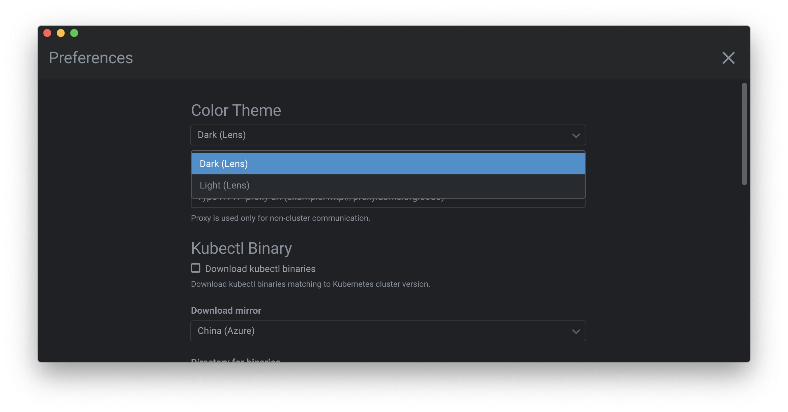

# Styling an Extension

Lens provides a set of global styles and UI components that can be used by any extension to preserve the look and feel of the application.

## Layout

For layout tasks, Lens uses the [flex.box](https://www.npmjs.com/package/flex.box) library which provides helpful class names to specify some of the [flexbox](https://developer.mozilla.org/en-US/docs/Web/CSS/CSS_Flexible_Box_Layout/Basic_Concepts_of_Flexbox) properties. For example, consider the following HTML and its associated CSS properties:

```html
<div className="flex column align-center"></div>
```

```css
div {
  display: flex;
  flex-direction: column;
  align-items: center;
}
```

However, you are free to use any styling technique or framework you like, including [Emotion](https://github.com/emotion-js/emotion) or even plain CSS.

### Layout Variables

There is a set of CSS variables available for for basic layout needs. They are located inside `:root` and are defined in [app.scss](https://github.com/lensapp/lens/blob/master/src/renderer/components/app.scss):

```css
--unit: 8px;
--padding: var(--unit);
--margin: var(--unit);
--border-radius: 3px;
```

These variables are intended to set consistent margins and paddings across components. For example:

```css
.status {
  padding-left: calc(var(--padding) * 2);
  border-radius: var(--border-radius);
}
```

## Themes

Lens uses two built-in themes defined in [the themes directory](https://github.com/lensapp/lens/tree/master/src/renderer/themes) – one light and one dark.

### Theme Variables

When Lens is loaded, it transforms the selected theme's `json` file into a list of [CSS Custom Properties (CSS Variables)](https://developer.mozilla.org/en-US/docs/Web/CSS/Using_CSS_custom_properties). This list then gets injected into the `:root` element so that any of the down-level components can use them.


When the user changes the theme, the above process is repeated, and new CSS variables appear, replacing the previous ones.

If you want to preserve Lens's native look and feel, with respect to the lightness or darkness of your extension, you can use the provided variables and built-in Lens components such as `Button`, `Select`, `Table`, and so on.

There is a set of CSS variables available for extensions to use for theming. They are all located inside `:root` and are defined in [app.scss](https://github.com/lensapp/lens/blob/master/src/renderer/components/app.scss):

```css
--font-main: 'Roboto', 'Helvetica', 'Arial', sans-serif;
--font-monospace: Lucida Console, Monaco, Consolas, monospace;
--font-size-small: calc(1.5 * var(--unit));
--font-size: calc(1.75 * var(--unit));
--font-size-big: calc(2 * var(--unit));
--font-weight-thin: 300;
--font-weight-normal: 400;
--font-weight-bold: 500;
```

as well as in [the theme modules](https://github.com/lensapp/lens/tree/master/src/renderer/themes):

```
--blue: #3d90ce;
--magenta: #c93dce;
--golden: #ffc63d;
--halfGray: #87909c80;
--primary: #3d90ce;
--textColorPrimary: #555555;
--textColorSecondary: #51575d;
--textColorAccent: #333333;
--borderColor: #c9cfd3;
--borderFaintColor: #dfdfdf;
--mainBackground: #f1f1f1;
--contentColor: #ffffff;
--layoutBackground: #e8e8e8;
--layoutTabsBackground: #f8f8f8;
--layoutTabsActiveColor: #333333;
--layoutTabsLineColor: #87909c80;
...
```

These variables can be used in the following form: `var(--magenta)`. For example:

```css
.status {
  font-size: var(--font-size-small);
  background-color: var(--colorSuccess);
}
```

A complete list of themable colors can be found in the [Color Reference](../color-reference).

### Theme Switching

When the light theme is active, the `<body>` element gets a "theme-light" class, or: `<body class="theme-light">`. If the class isn't there, the theme defaults to dark. The active theme can be changed in the **Preferences** page:


Currently, there is no prescribed way of detecting changes to the theme in JavaScript. [This issue](https://github.com/lensapp/lens/issues/1336) has been raised to resolve this problem. In the meantime, you can use a [MutationObserver](https://developer.mozilla.org/en-US/docs/Web/API/MutationObserver) in order to observe the `<body>` element's `class` attribute in order to see if the "theme-light" class gets added to it:

```javascript
...
  useEffect(function () {
    const observer = new MutationObserver(function (mutations: MutationRecord[]) {
      mutations.forEach((mutation: MutationRecord) => {
        if (mutation.type === 'attributes' && mutation.attributeName === 'class') {
          if ((mutation.target as HTMLElement).classList.contains('theme-light')) {
            // theme is LIGHT
          } else {
            // theme is DARK
          }
        }
      });
    });

    observer.observe(document.body, {
      attributes: true,
      attributeFilter: ['class'],
    });

    return function () {
      observer.disconnect();
    };
  }, []); // run once on mount
...
```

## Injected Styles

Every extension is affected by the list of default global styles defined in [app.scss](https://github.com/lensapp/lens/blob/master/src/renderer/components/app.scss). These are basic browser resets and element styles, including setting the `box-sizing` property for every element, default text and background colors, default font sizes, basic heading formatting, and so on.

Extensions may overwrite these defaults if needed. They have low CSS specificity, so overriding them should be fairly easy.

## CSS-in-JS

If an extension uses a system like `Emotion` to work with styles, it can use CSS variables as follows:

```javascript
const Container = styled.div(() => ({
  backgroundColor: 'var(--mainBackground)'
}));
```
